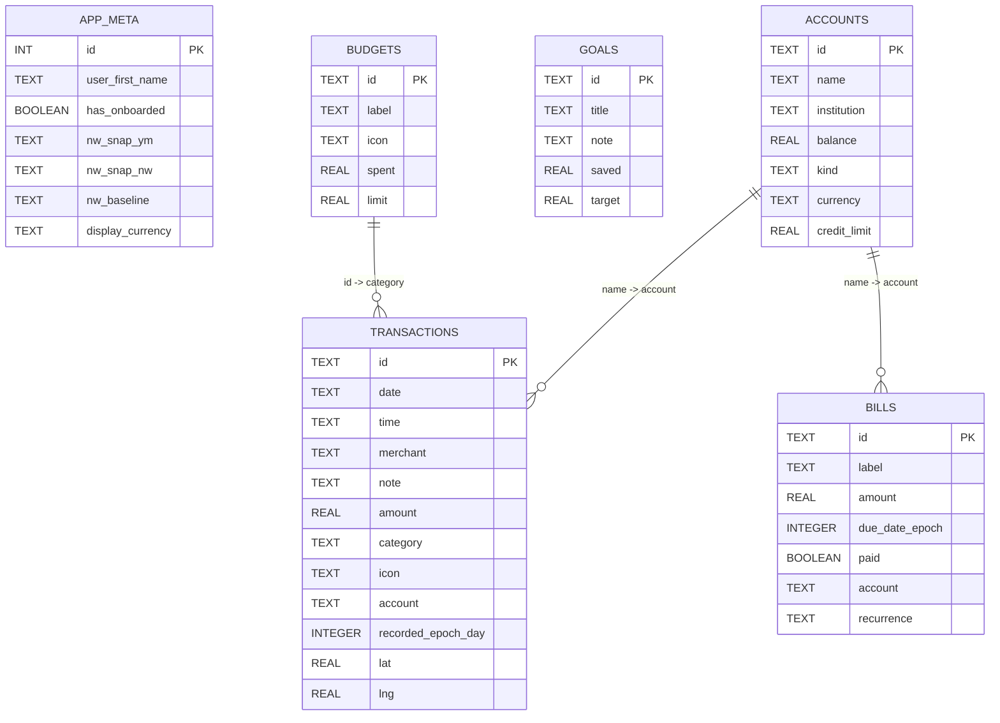

# Truffle Database Schema (Room v6)

This document reflects the current Room database schema defined in:

- `app/src/main/java/com/truffleapp/truffle/data/db/LedgerDatabase.kt`
- `app/src/main/java/com/truffleapp/truffle/data/db/LedgerEntities.kt`

Database file name: `truffle_ledger.db`  
Schema version: `6`

## ER Diagram (Mermaid)

## Relationship Notes

- `accounts` -> `transactions`: logical one-to-many via `transactions.account` matching `accounts.name`.
- `accounts` -> `bills`: logical one-to-many via `bills.account` matching `accounts.name`.
- `budgets` -> `transactions`: logical one-to-many via `transactions.category` matching `budgets.id`.
- `app_meta` is effectively a singleton table (`id = 1`) for app-level state and onboarding metadata.
- `goals` has no persisted foreign-key relation to `accounts` in the Room schema.

## Important Constraints / Behavior

- No explicit Room `@ForeignKey` constraints are defined in entities.
- `LedgerDao.replaceAll()` rewrites all core tables in one transaction (`accounts`, `transactions`, `bills`, `goals`, `budgets`, and `app_meta`).
- Budget `spent` values are derived/recomputed from transaction outflows by category in `LedgerDerivations.kt`.
- `transactions.lat` and `transactions.lng` are nullable (added in migration `5 -> 6`).
